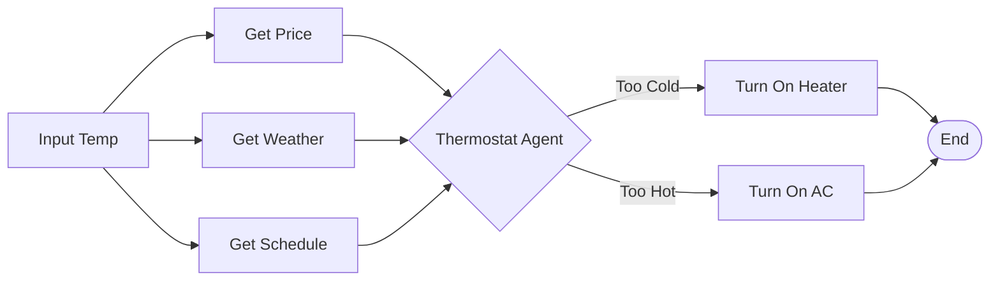

# Antigravity Workflow Engine

Antigravity is a lightweight, asynchronous workflow engine built with Python. It supports Directed Acyclic Graphs (DAGs), parallel execution, and **LLM-driven dynamic routing** via Agent Nodes.

## Features

- **Async Execution**: Built on `asyncio` for high-performance concurrent node execution.
- **Dynamic Routing**: `AgentNode` uses LLMs (OpenAI-compatible) to intelligently decide which path to take in the workflow.
- **Conditional Execution**: Automatically handles skipping of unselected paths and merging of results.
- **Persistence**: Built-in support for tracking workflow runs using SQLite and SQLModel.
- **Modern Stack**: Uses `uv` for fast package management and `FastAPI` for the web interface.
- **Dockerized**: Ready-to-deploy with Docker and Docker Compose.

## Architecture

The engine executes workflows as Directed Acyclic Graphs (DAGs).

```mermaid
flowchart TD
    Start([Start Workflow]) --> Init[Build Graph & Calculate In-Degrees]
    Init --> FindReady[Find Ready Nodes (In-Degree 0)]
    FindReady --> CheckQueue{Queue Empty?}
    
    CheckQueue -- Yes --> Finish([End Workflow])
    CheckQueue -- No --> PopNode[Pop Node from Queue]
    
    PopNode --> CheckSkip{Is Parent SKIPPED?}
    CheckSkip -- Yes --> MarkSkip[Mark Node SKIPPED]
    CheckSkip -- No --> ExecNode[Execute Node]
    
    ExecNode --> IsAgent{Is Agent Node?}
    IsAgent -- Yes --> CallLLM[Call LLM to Select Path]
    CallLLM --> MarkUnselected[Mark Unselected Paths SKIPPED]
    IsAgent -- No --> StoreResult[Store Result]
    
    MarkSkip --> UpdateChildren[Update Children In-Degrees]
    StoreResult --> UpdateChildren
    MarkUnselected --> UpdateChildren
    
    UpdateChildren --> FindReady
```

## Project Structure

```
.
├── app/                    # Main application logic
│   └── main.py             # FastAPI entry point
├── workflow/               # Core workflow engine
│   ├── engine.py           # Execution logic (DAG traversal)
│   ├── nodes.py            # Node implementations (Start, Http, Agent, End)
│   ├── models.py           # Pydantic models for configuration
│   └── database.py         # Persistence layer
├── examples/               # Demo scripts
│   ├── demo_workflow.py    # Basic parallel execution demo
│   ├── demo_agent_workflow.py # Agent routing demo
│   └── demo_persistence.py # Database persistence demo
├── Dockerfile
├── docker-compose.yml
└── pyproject.toml
```

## Installation

This project uses [uv](https://github.com/astral-sh/uv) for dependency management.

1. **Install uv**:
   ```bash
   curl -LsSf https://astral.sh/uv/install.sh | sh
   ```

2. **Sync dependencies**:
   ```bash
   uv sync
   ```

3. **Activate virtual environment**:
   ```bash
   source .venv/bin/activate
   ```

## Usage

### Running Examples

**1. Agent Workflow (Dynamic Routing)**
This demo shows an Agent Node deciding between "Path A" and "Path B" based on input.

*Note: Requires an OpenAI API Key for real inference. Without it, it falls back to mock logic.*

```bash
export OPENAI_API_KEY="sk-..."
python examples/demo_agent_workflow.py
```

**2. Basic Parallel Workflow**
Demonstrates parallel execution of HTTP nodes.

```bash
python examples/demo_workflow.py
```

**3. Smart Home Automation (Complex Logic)**
A workflow that fetches data (Price, Weather, Schedule) in parallel, then uses an Agent to decide whether to turn on the Heater or AC.



```bash
python examples/smart_home_workflow.py
```

### Running the API Server

Start the FastAPI server:

```bash
uvicorn app.main:app --reload
```

Or using Docker:

```bash
docker-compose up --build
```

## Configuration

| Environment Variable | Description | Default |
|----------------------|-------------|---------|
| `OPENAI_API_KEY`     | Required for `AgentNode` to call LLM. | None (Mock mode) |
| `DATABASE_URL`       | Connection string for persistence. | `sqlite:///database.db` |

## License

[MIT](LICENSE)
